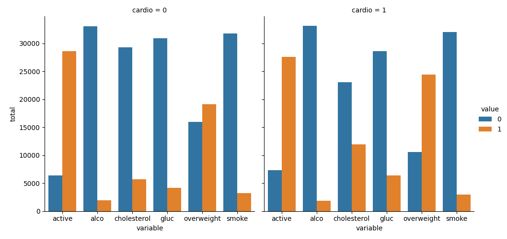
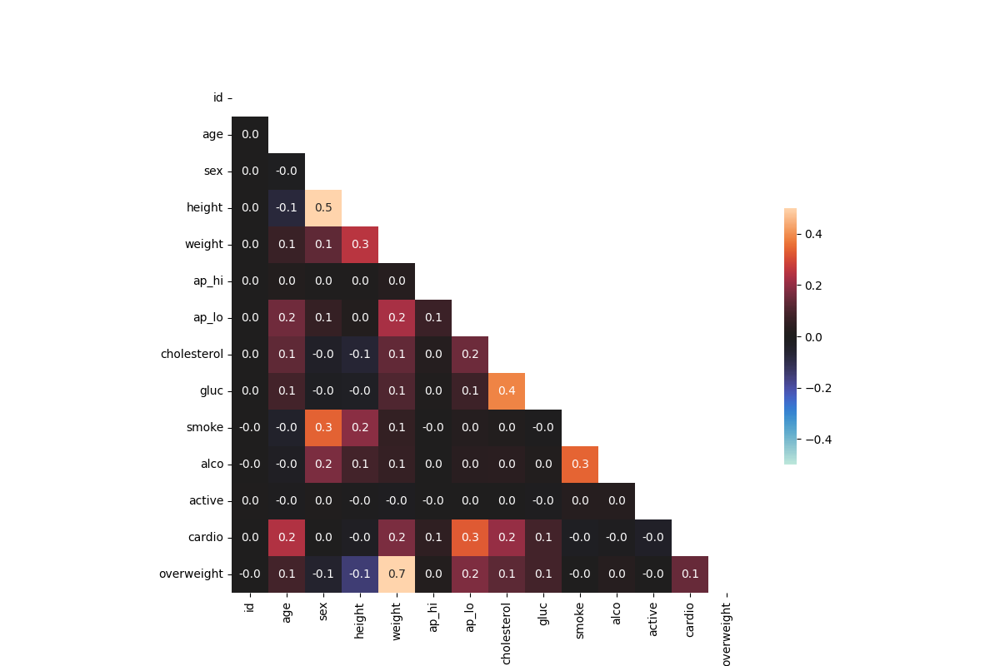

<div align="center">

# 🏥 Medical Data Visualizer

### *Cardiovascular Risk Analysis with Pandas, Matplotlib & Seaborn*


[](https://www.python.org/)
[](https://pandas.pydata.org/)
[](https://matplotlib.org/)
[](https://seaborn.pydata.org/)
[](https://www.freecodecamp.org/)
[](https://opensource.org/licenses/MIT)

</div>

---

## 📖 Overview

**Medical Data Visualizer** analyses a dataset of **70,000 patient examinations** to uncover patterns linking lifestyle, body measurements, and cardiovascular disease.

Built as part of the **freeCodeCamp Data Analysis with Python** certification, this project demonstrates end-to-end data analysis: from raw CSV cleaning to publication-ready visualisations.

> 🎯 **Goal**: Identify how factors like cholesterol, glucose, activity, alcohol, and BMI relate to cardiovascular disease incidence.

---

## 📊 Visualisations

### 1. Categorical Plot — Health Indicators by Cardio Status

Compares 5 binary health indicators (cholesterol, glucose, smoking, alcohol, activity, overweight) between patients **with** and **without** cardiovascular disease.



**Key insight**: Patients with cardiovascular disease show notably higher rates of elevated cholesterol and glucose levels.

---

### 2. Correlation Heatmap — Variable Relationships

Visualises the **Pearson correlation matrix** between all variables, with the upper triangle masked for clarity.



**Key insight**: Strong correlations between **weight & BMI**, and meaningful associations between **cholesterol, glucose, and cardiovascular disease**.

---

## 🎯 Key Features

- 🧹 **Data Cleaning** — Removes invalid blood pressure readings, normalises body measurements
- 📏 **Feature Engineering** — Computes BMI and creates the `overweight` binary indicator
- 🔄 **Data Normalisation** — Rescales cholesterol & glucose to binary (`0` = normal, `1` = elevated)
- 📊 **Categorical Analysis** — Aggregated counts visualised with Seaborn's `catplot`
- 🔥 **Correlation Analysis** — Triangular heatmap to avoid redundancy
- ✅ **Reproducible** — Single command to regenerate both plots

---

## 🚀 Getting Started

### Prerequisites

- Python 3.8+
- pip

### Installation

```bash
# Clone the repository
git clone https://github.com/The-Special-One1/medical-data-visualizer.git
cd medical-data-visualizer

# Install dependencies
pip install pandas matplotlib seaborn numpy

# Run the visualiser
python main.py
